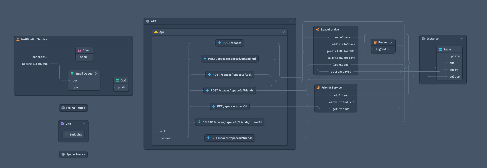

<h1> QuickShare</h1>

### Wing demo application

This application let's users create spaces where they can share files with each other. Each space lives for 30 minutes.

### Cloud resources used

- API 
    - built using Wing [cloud.API](https://www.winglang.io/docs/api/standard-library/cloud/api)
- Database
    - Using Amazon DynamoDB ([@winglib/dynamodb](https://www.winglang.io/docs/winglibs/winglibs/dynamodb))
- Database Streams (Change data capture)
    - Using Amazon DynamoDB ([@winglib/dynamodb](https://www.winglang.io/docs/winglibs/winglibs/dynamodb))
- Emails
    - Using Amazon SES ([@winglib/ses](https://www.winglang.io/docs/winglibs/winglibs/ses))

**Wing console example**

